# The Billboard Hot 100: <br/>Exploring Six Decades of Number One Singles   

**Mark Bannister**
*April 2017*


------

## Introduction
In this report, I will be analysing data relating to each weekly number one 
single from the [Billboard Hot 100](http://www.officialcharts.com/charts/billboard-hot-100-chart/), from the 
chart's inception in August 1958 to the present day. The data was sourced from [Spotify](https://developer.spotify.com/web-api/get-several-audio-features/) and 
[Wikipedia](https://en.wikipedia.org/wiki/List_of_Billboard_number-one_singles), 
and contains both musical analysis (such as tempo, loudness and key), and chart 
performance data (such as chart date and total weeks at number one). I will 
explore the data to investigate, among other things:

* How number one singles have changed over time; 
* Whether number one singles tend to have any particular musical features in 
common; and
* To what extent a number one single's performance (in terms of total
weeks at number one) can be explained by any of its musical attributes.

------

## Chart performance

### Total weeks at number one

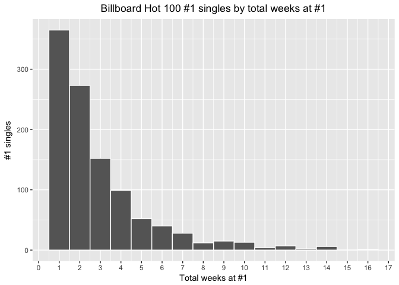<!-- -->


```
##    Min. 1st Qu.  Median    Mean 3rd Qu.    Max. 
##   1.000   1.000   2.000   2.876   4.000  16.000
```

Let's begin by exploring the distribution of total weeks spent at number one for 
each track. We can see that the majority of number one singles maintain their 
spot for three weeks or less (the median is two weeks), while the record for 
most weeks at number one is 16 (achieved by Mariah Carey and Boyz II Men with 
"One Sweet Day" in 1995). Even more impressively, this was managed in a single 
16-week run, which was eventually stopped by Céline Dion with "Because You Loved 
Me" (itself managing an impressive six week stay at the top).


```
##                         title            artist_1 year total_weeks
## 810           "One Sweet Day"        Mariah Carey 1995          16
## 780  "I Will Always Love You"     Whitney Houston 1992          14
## 797   "I'll Make Love to You"         Boyz II Men 1994          14
## 818                "Macarena"         Los Del Rio 1996          14
## 922      "We Belong Together"        Mariah Carey 2005          14
## 981         "I Gotta Feeling" The Black Eyed Peas 2009          14
## 1048            "Uptown Funk"         Mark Ronson 2015          14
## 778         "End of the Road"         Boyz II Men 1992          13
## 838         "The Boy Is Mine"              Brandy 1998          13
## 858                  "Smooth"             Santana 1999          12
```

This was not an isolated success for Mariah Carey and Boyz II Men, as both 
artists separately hold joint second-place with "We Belong Together" and 
"End of the Road", respectively, with 14 weeks each. Interestingly, the top 10 
most successful number ones (judged by weeks at number one), all occurred in 
1992 or later, with seven in the 1990s alone.

### Total number one singles per year

*Note, throughout this section I have excluded 2017 data from charts that depict 
annual totals to avoid potentially misleading trends. I have included 2017 data
in all charts that depict rates and ratios. For the avoidance of doubt, a 
"unique" number one is a number one single that has not held the position 
previously (in any year). 'Entry/entries' refers to the consecutive period(s) of 
time during which the single was number one.*

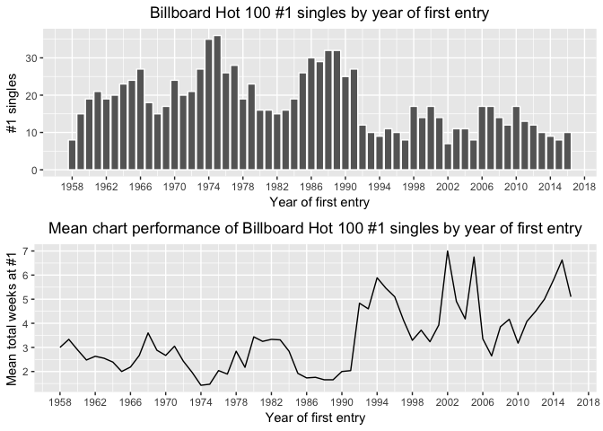<!-- -->

The above charts explore this trend further, demonstrating a downward trend in 
the number of unique number ones per year following a general high in the 1970s 
(with an all time peak in 1975^1^). This surprised me, because the general wisdom 
is that the barriers to making and releasing music have been getting lower over
time, while streaming services like Spotify and Apple Music give fans 
unprecedented access to millions of records. And yet, we seem to be 
consolidating our listening around a smaller number of hit songs.

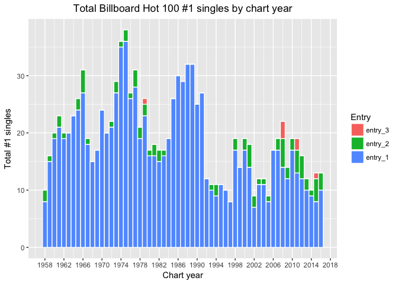<!-- -->

2008 was particularly emblematic of this trend, with 22 Hot 100 number ones in 
total, only 14 of them unique. It was also the year with the highest number of 
third-entry number ones, with "Bleeding Love" (Leona Lewis), "Live Your Life" 
(T.I. featuring Rihanna) and "Whatever You Like" (also T.I.) clinching the top 
spot three times each, for a total of four, six and seven weeks, respectively.

^1^ Note that the data set counts double A-side records as separate releases, 
therefore 1975 has 36 unique number ones because of "I'm Sorry" and "Calypso" by 
John Denver. If we consider this to be one release, both 1974 and 1975 are tied 
at 35 unique number ones.

### Artist trends

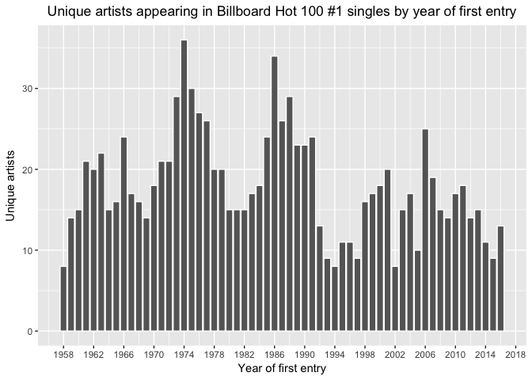<!-- -->

As you might expect, we can also see a similar decline in the number of unique 
artists that achieve a number one hit in any given year. We can explore this 
trend from a different angle by plotting the ratio of unique artists to unique 
number one tracks for each year.

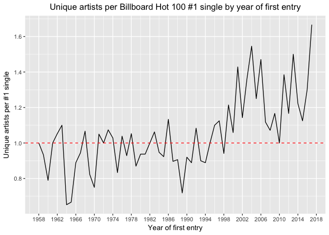<!-- -->

I have highlighted the point at which the ratio equals 1.0, which would indicate 
a year in which each number one single was released by a different artist. 
Ratios of less than one suggest a select group of artists dominating the charts, 
while ratios of greater than one suggest that one or more number ones included 
featured artists.

This chart suggests that while the early years of the Hot 100 may have had many 
more unique number one tracks, they tended to be from a relatively smaller pool 
of artists in any given year. Take 1964-65, in which 16 of the 47 unique number 
one singles in that period were recorded by The Beatles or The Supremes (10 and 
six, respectively). Not to mention the repeat number ones achieved by Bobby 
Vinton, Herman's Hermits, Four Tops, The Byrds and The Rolling Stones in the 
same period!

Similar feats of chart domination within a single year were achieved by Elvis 
Presley in 1960, The Jackson 5 in 1970, and Paula Abdul and Milli Vanilli in 
1989. 

That the ratio only dipped below 1.0 twice after 1995 suggests that, even if 
number ones are maintaining their status at the top for more weeks at a time, 
we are exposed to more unique artists per number one track than ever before. 
This is down to the rise in the use of featured / guest artists, which is 
charted below.

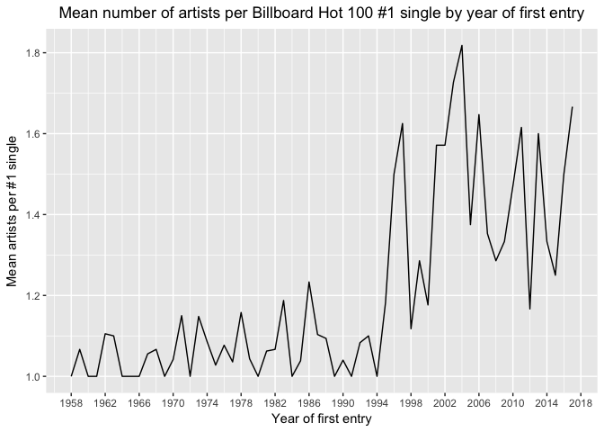<!-- -->

The use of guest artists in pop music is evidently a relatively modern 
phenomenon, likely related to the rise in prominence of hip hop from the '90s 
onwards. Features are a staple of the genre and are used as a means of appealing 
to two different fan bases.

In a pop music context, collaborations are also used as a means of generating 
crossover hits that appeal to fans of two different genres, thereby increasing 
their marketing potential. Katy Perry is an artist that has deployed this to 
notable effect, with three of her nine (!) number one singles featuring hip hop 
artists.

### Summary findings - chart performance

Having analysed the overall performance of Billboard Hot 100 number one singles, 
we've identified a number of intriguing insights:

* The vast majority of number ones only maintain their position for 1-3 weeks. 
However, this has changed dramatically in the last 25 years as fewer unique 
singles make it to number one, with a corresponding increase in the average 
number of weeks spent at the top.
* There has been an increase in the number of songs enjoying multiple reigns at 
number one, but no song has ever been number one more than three times.
* The average number of artists per track has increased significantly since 
1995, highlighting the trend of 'featured artists'.

#### Analysis

These insights all raise interesting questions: are we, as seems to be the case, 
consolidating our listening around a smaller number of tracks, despite having 
more choice than ever before? Are music-on-demand services leading to us 
coalesce around the same blockbuster hits, rather than broadening our horizons?

It's worth pointing out that the methodology behind the Hot 100 
[has changed over the years](https://en.wikipedia.org/wiki/Billboard_Hot_100#Digital_downloads_and_online_streaming) to ensure the chart stays relevant. In its early years, the 
Hot 100 was based entirely on in-store sales and radio airplay. However, 
[a truly seismic shift occured in 1991](http://ultimateclassicrock.com/billboard-soundscan/), 
when Billboard began using electronic sales data compiled by SoundScan to 
produce its charts. The effect was immediate, and has been cited as playing a 
major role in the careers of rock, country and hip hop artists like Nirvana, 
Garth Brooks and N.W.A. As far as the Hot 100 is concerned, it also 
["ushered in an era of repetition"](http://nypost.com/2017/02/09/how-1991-changed-music-as-we-knew-it/), which is borne out in the data.

More recent changes to the methodology included adding digital sales in 2005, 
streaming (from certain services) in 2007, and Spotify streams and YouTube views 
in 2013 (the most recent revision). [According to Billboard](http://www.billboard.com/articles/columns/ask-billboard/5740625/ask-billboard-how-does-the-hot-100-work), "the current formula targets a ratio of sales (35-45%), 
airplay (30-40%) and streaming (20-30%)".

It is important to consider that by including streaming data as well as sales 
data, fans' listening habits are playing an increasingly important role in chart 
compilation. For example, we now include the casual fan or even non-fan, who 
checks out a new single online, possibly adds it to a playlist, but would never 
consider purchasing it.

Streaming services also represent the music industry's attempt to create a new 
business model after the disruption of P2P sharing in the early '00s. 
[A recent article in the FT](https://www.ft.com/content/f72b1d2c-1937-11e7-a53d-df09f373be87) notes that "US streaming revenues rose to \$3.9bn last year — 51 per cent of a 
total of $7.7bn. The latter is only half the industry’s sales in 1999, before 
the outbreak of digital piracy, but growth has returned." With labels competing 
in a less profitable industry, it is possible that they now commit a greater 
proportion of their marketing resources to a smaller number of singles with 
strong hit potential, with the result being fewer, but more successful (in chart 
terms) number ones.

Having interrogated the chart data, I still have some questions: what is it 
about some tracks that makes us gravitate towards them? Can it be explained 
scientifically? And how on earth did "Macarena" stay number one for 14 weeks in 
a single run?!

By examining the musical features of each track, I hope to gain further insight.

------

## Musical analysis

### Tempo

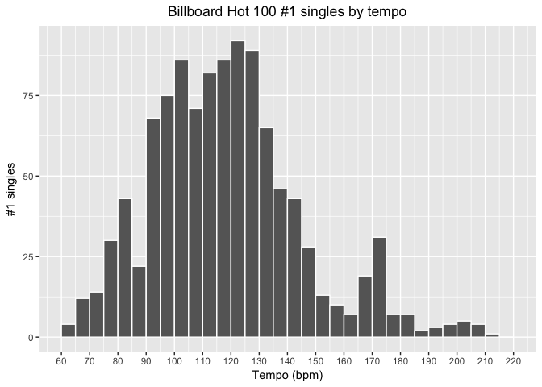<!-- -->


```
##    Min. 1st Qu.  Median    Mean 3rd Qu.    Max. 
##   61.85   99.99  116.60  118.50  131.40  213.80
```

The chart above shows the distribution of track tempos (in beats per minute), 
which is approximately normal with some positive skew. 73.6% of tracks have 
tempos within one standard deviation of the mean - that is, in the range 
91.8-145.1 bpm. 

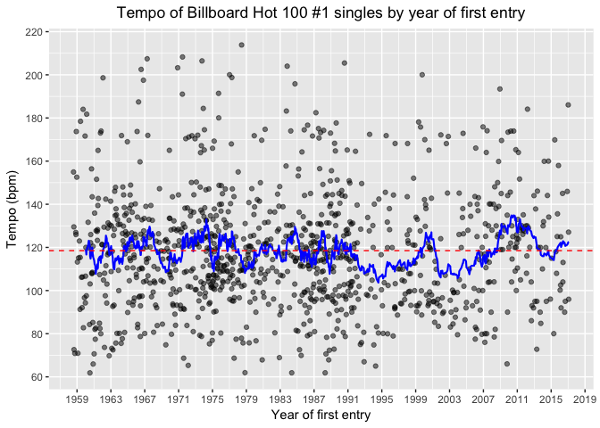<!-- -->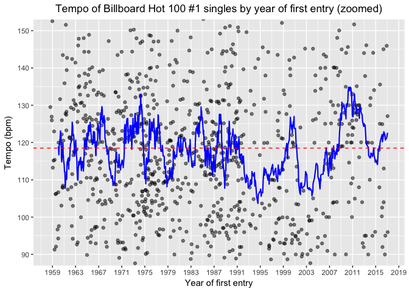<!-- -->

When charted over time, we can see the mean tempo change with the era. While 
always hovering around the long run mean of 118.5 bpm (denoted by the dashed 
red line), there were periods of significant deviation. Several of these appear 
to coincide with the rise of distinct musical styles within pop, including 
British rock (mid '60s), disco (mid-late '70s), modern R&B ('90s), and EDM (late 
'00s and early '10s).

### Duration

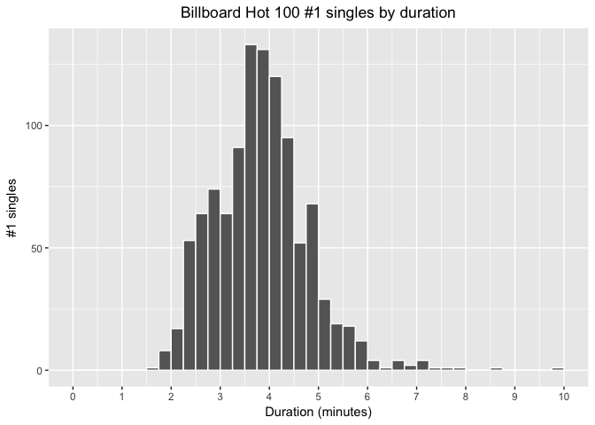<!-- -->


```
##    Min. 1st Qu.  Median    Mean 3rd Qu.    Max. 
##   1.582   3.206   3.811   3.838   4.369   9.782
```

Plotting a histogram of tracks by duration, we can see that this is also an
approximately normal distribution, with tracks concentrated closely around the
mean duration of 3.8 minutes.

The shortest track is "Stay" by Maurice Williams & The Zodiacs, which [according to Wikipedia](https://en.wikipedia.org/wiki/Stay_(Maurice_Williams_song)) "...remains 
the shortest single ever to reach the top of the American record charts, at 1 
minute 36 seconds in length."

At the other end of the spectrum is "Stars on 45", released by the group of the
same name in 1981. This was a medley of a number of popular songs from previous
years, and was released as a number of different edits of varying duration. The 
version in our data set is 9 minutes 47 seconds long.

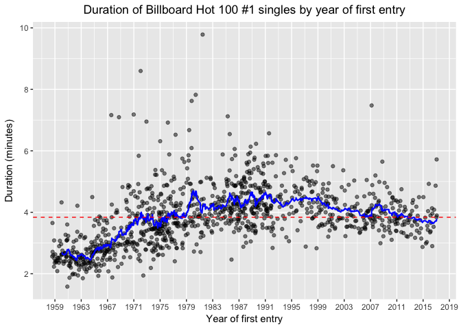<!-- -->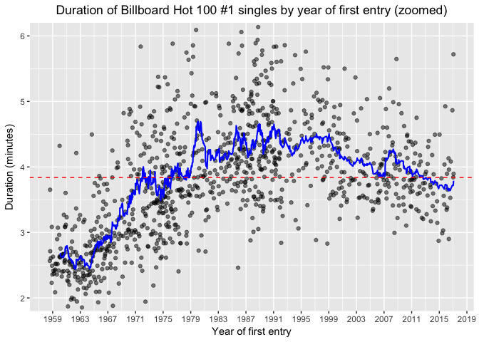<!-- -->

By plotting track duration over time, we can see that number one singles have 
become longer on average over time. However, this trend has been reversing since 
2009, with average durations recently declining below the long term mean of 3.8 
minutes (depicted by the dashed red line). Perhaps an indication of 
[shortening attention spans?](http://www.telegraph.co.uk/science/2016/03/12/humans-have-shorter-attention-span-than-goldfish-thanks-to-smart/)

### Key

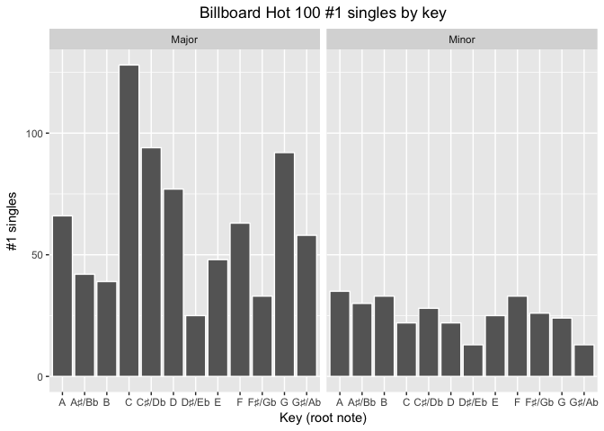<!-- -->

By charting the frequency of particular keys, we can see that number one singles 
are more frequently written in major keys than minor, perhaps suggesting that 
pop music fans may be more drawn to music that is 'happy' in tone.

We can also observe that the distribution of minor keys is more uniform than 
that of major, for which the most popular key (C Major) occurs 5.1x more 
frequently than the least popular (D♯/Eb Major). The most popular minor key 
(A Minor) was used in 2.7x more number one singles than the joint least popular 
(D♯/Eb Minor and G♯/Ab Minor).

It is interesting to note that the most popular minor key is the relative minor 
of the most popular major key. In musical terms, this means they have the same 
number of sharp/flat notes in their respective scales (in this case, none). 
However, the data do not suggest that the presence of sharp or flat notes in a 
given key necessarily makes it more or less suitable for popular music; the 
second most widely-used key is C♯/Db Major, which has either five flats or seven 
sharps, depending on the harmony of the piece.


```
## 
## 	Chi-squared test for given probabilities
## 
## data:  table(subset(billboard, mode == "Major")$key)
## X-squared = 154.29, df = 11, p-value < 2.2e-16
```

```
## 
## 	Chi-squared test for given probabilities
## 
## data:  table(subset(billboard, mode == "Minor")$key)
## X-squared = 22.447, df = 11, p-value = 0.02113
```

By performing [chi-squared goodness-of-fit tests](https://en.wikipedia.org/wiki/Pearson%27s_chi-squared_test) on the 
distributions of major and minor keys at the 95% confidence level, we can 
confirm that neither of the respective distributions were likely to have 
occurred by chance - in other words, certain keys appear to be more favoured by 
writers of number one pop singles than others. However, the data do not tell us 
whether this is a feature unique to number one singles (and hence a possible 
factor in their popularity), or if it can also be found in pop music more 
generally. It would be useful to compare the sample data with a much broader 
data set to test these findings further.

### Time signature

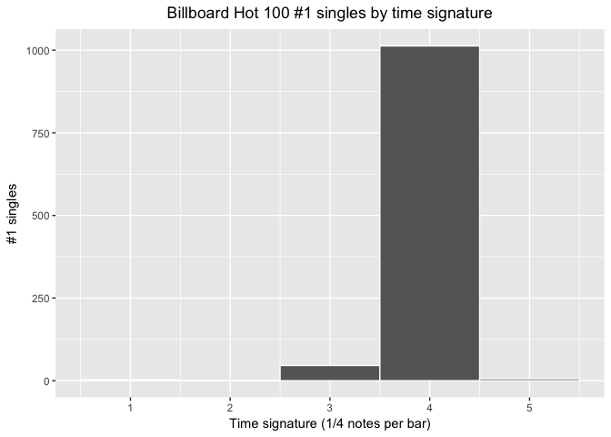<!-- -->

Perhaps unsurprisingly, the vast majority of top-selling singles are written in
4/4 time, which lends itself well to the sort of catchy rhythms and driving 
beats I would associate chart music with. In fact, I was surprised that any 5/4 
songs would have made it to number one and decided to investigate further.


```
##               title          artist_1 year
## 748  "One More Try"           Timmy T 1991
## 915     "Lean Back"      Terror Squad 2004
## 920    "Candy Shop"           50 Cent 2005
## 993    "Not Afraid"            Eminem 2010
## 998     "Like a G6" Far East Movement 2010
## 1054    "The Hills"        The Weeknd 2015
```

Sure enough, manually reviewing the above list of songs confirms that they are 
all in 4/4 time, suggesting that Spotify's beat analysis software has some room 
for improvement!

The data on 3/4 songs appears to be more accurate, though I was still curious, 
given that this is a relatively uncommon time signature in pop music. I 
suspected that perhaps this was more common in older hits. The histogram below, 
which shows the frequency of 3/4 time number one singles over the life of the 
Hot 100, confirms this suspicion.

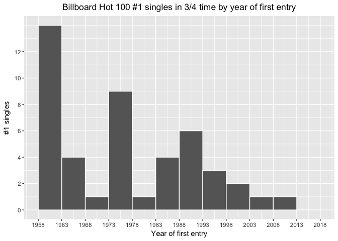<!-- -->

### Loudness

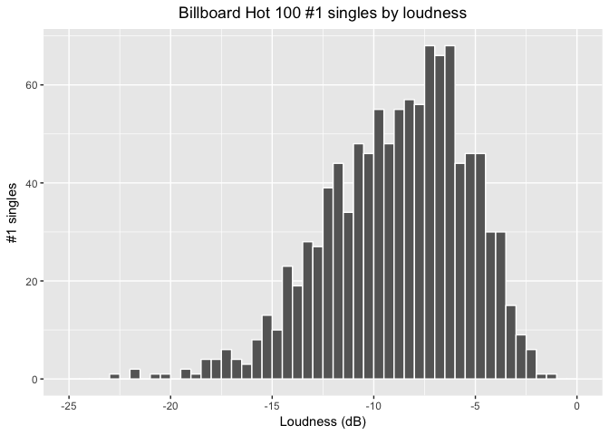<!-- -->


```
##    Min. 1st Qu.  Median    Mean 3rd Qu.    Max. 
## -22.590 -11.090  -8.392  -8.827  -6.257  -1.185
```

While dynamics are certainly a feature of musical performance, loudness is more 
a factor of studio production and mastering. Given recorded audio has a 
practical ceiling at 0 dB, a negatively skewed distribution like that depicted 
in the above chart is unsurprising.

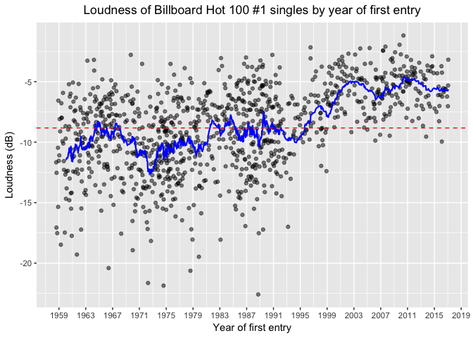<!-- -->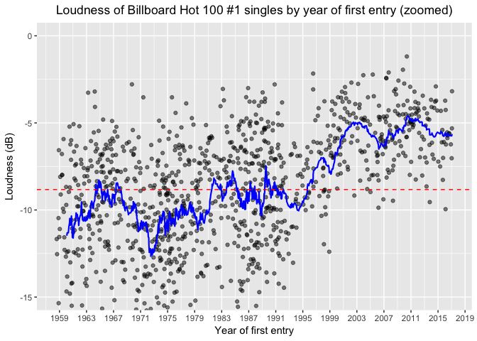<!-- -->

By plotting loudness over time, we can see that number one singles have followed 
a [well-documented trend](http://www.bbc.co.uk/news/entertainment-arts-35250557) 
in getting louder over the years^2^. It is interesting to note however that the 
change was not gradual, but rather fluctuated around -10 dB before increasing 
rapidly from 1995 to 2003. The trend has since stabilised, perhaps because at 
approximately -5 dB, there isn't much room for an increase without producing 
unpleasant distortion.

While certainly more attention-grabbing, louder tracks tend to have lower 
dynamic ranges - an arguably less 'musical' outcome. 

^2^ I should note that there will be additional variance present in the data due 
to some audio analysis unavoidably being based on recent remasters of the 
original recordings.

### Explicit lyrics

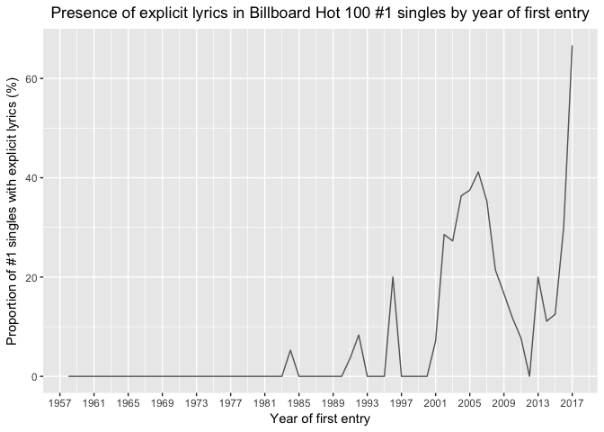<!-- -->

The chart above shows a fascinating trend: the emergence of explicit lyrics 
within number one singles. It appears that this is a fairly recent phenomenon, 
with only five explicit singles topping the charts in the 44 years to 2001 (the 
first only appearing in 1984). Since 2001 however, with the exception of 2012, 
there hasn't been a year without at least one number one single carrying a 
parental advisory label. 

2017 is off to a particularly profane start, with two of the three new number 
one singles thus far using explicit lyrics ("Starboy" by The Weeknd feat. Daft 
Punk and "Bad and Boujee" by Migos feat. Lil Uzi Vert). The only other number 
one this year, a re-entry of "Black Beatles" by Rae Sremmurd feat. Gucci Mane, 
also uses explicit lyrics, bringing the proportion to a full 75% of the total 
Hot 100 number ones in 2017 so far (as of April). A sign of the times?

### Feel

As well as more traditional musical features, Spotify also tries to quantify the 
'feel' of a track [through a number of measures](https://developer.spotify.com/web-api/get-several-audio-features/), 
including:

* Danceability - "a combination of musical elements including tempo, rhythm 
stability, beat strength, and overall regularity.";
* Energy - "a perceptual measure of intensity and activity...perceptual features 
contributing to this attribute include dynamic range, perceived loudness, 
timbre, onset rate, and general entropy."; and
* Valence - "the musical positiveness conveyed by a track. Tracks with high 
valence sound more positive (e.g. happy, cheerful, euphoric), while tracks with 
low valence sound more negative (e.g. sad, depressed, angry)."

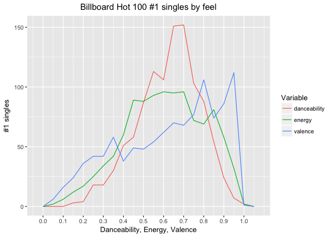<!-- -->

The above chart shows the distribution of danceability, energy, and valence 
scores for every track in our data set. We can see that number one singles tend 
to score in the upper range for each of these measures, particularly for 
valence. Given this is a measure of musical 'positivity', this finding seems to 
back up my earlier assertion about fans being drawn to 'happy' music.


```
##   danceability        energy          valence      
##  Min.   :0.1450   Min.   :0.0264   Min.   :0.0383  
##  1st Qu.:0.5250   1st Qu.:0.4640   1st Qu.:0.4340  
##  Median :0.6410   Median :0.6090   Median :0.6680  
##  Mean   :0.6228   Mean   :0.6044   Mean   :0.6259  
##  3rd Qu.:0.7300   3rd Qu.:0.7560   3rd Qu.:0.8310  
##  Max.   :0.9780   Max.   :0.9890   Max.   :0.9790
```

The mean valence for Hot 100 number one singles is 0.6259, which is notably 
higher than [the average valence that Spotify found in 2013](https://insights.spotify.com/us/2013/11/05/musics-emotion-over-time/) 
when testing the top 5,000 songs by year of release. That analysis showed that 
the average valence was consistently around 0.5 across the decades.


```
## 
## 	One Sample t-test
## 
## data:  subset(billboard, select = "valence")
## t = 16.685, df = 1068, p-value < 2.2e-16
## alternative hypothesis: true mean is greater than 0.5
## 95 percent confidence interval:
##  0.6134651       Inf
## sample estimates:
## mean of x 
## 0.6258864
```

By performing a [one-sample t-test](https://en.wikipedia.org/wiki/Student%27s_t-test#One-sample_t-test) at 
the 95% confidence level, we can see that, assuming 0.5 is the true average 
valence score for pop music in general, number one singles are significantly 
more likely to have higher valence scores on average. This does not necessarily 
prove that music fans are more likely to buy or stream 'happy' sounding music; 
getting a number one record relies on a number of factors, not least heavy 
promotion by the record's label to build awareness. It could be the case that 
label executives are more comfortable committing large marketing budgets to 
songs that make them feel happy!


```
##        title          artist_1 year  mode valence total_weeks
## 1041 "Happy" Pharrell Williams 2014 Major   0.962          10
```

To illustrate this with an example, take the song "Happy" by Pharrell Williams 
from 2014. This song is about as happy as it gets, from the harmony, to the 
feel, to the lyrics themselves! Unsurprisingly, it scores 0.962 for valence. 
Whether or not this was a contributing factor to its monster 10 weeks at number 
one isn't clear, but these findings suggest it can't have hurt its chances!

### Summary findings - musical analysis

* Tempo has been relatively consistent over time, fluctuating around 118 bpm 
with notable periods of higher or lower tempos.
* Loudness has not been consistent however, with tracks increasing in volume 
particularly between 1995 and 2003. Loudness now sits near the practical ceiling 
of 0 dB.
* 70.5% of number one singles are between 2.8 and 4.8 minutes long. The average 
duration of number one singles has declined in recent years.
* It is extremely rare for a number one single to be in anything other than 4/4 
time.
* Number one singles are 2.5x more likely to be written in major keys (than 
minor). C Major is the most popular key overall.
* The presence of explicit lyrics in number one singles has gone from being 
non-existent to de rigueur.
* Number one singles tend to score highly for danceability, energy, and valence. 
* Comparisons with a wider study on valence in popular music suggest that number 
one singles are significantly likely to have higher than average valence scores.

------

## Musical features and chart performance - is there a connection?

Having explored overall trends in both the chart performance and musical 
features of Hot 100 number one singles, I am interested in investigating whether 
there are any potential relationships between the two. Does a particular key or 
tempo predict a longer stay at the top of the chart? Or perhaps it's all down to 
danceability?

Given the major changes in chart performance observed in the post-1991 era, this 
investigation will focus only on data from 1992 onwards.

### Chart performance by key


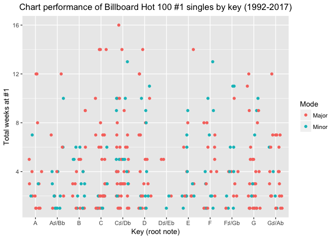<!-- -->

The above chart plots the total weeks at number one for every track in our data 
set (from 1992 to 2017), against each track's key. Note I added some horizontal 
jitter to reduce the overplotting somewhat. 

We observed earlier that D♯/Eb was the least popular root note for number one 
songs, in both major and minor tonalities. This certainly appears to be 
consistent in the modern era of the Hot 100, with only five number one songs 
written in these keys since 1992. Notably, these are the only keys never to have 
achieved a total stay at number one of longer than five weeks.

We can also see that of the 30 songs to achieve a total stay of 10 weeks or 
longer (i.e. the top 10% best performing number ones), only nine were written in 
a minor key. And no song in a minor key has maintained a number one position for 
longer than 14 weeks.

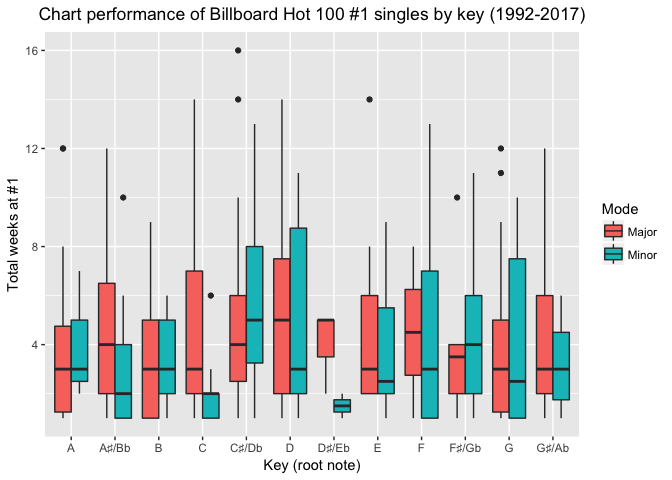<!-- -->


```
##    Min. 1st Qu.  Median    Mean 3rd Qu.    Max. 
##   1.000   2.000   3.000   4.349   6.000  16.000
```

By plotting box plots of each key, we can see that some keys do seem to perform 
better than others, with C♯/Db Minor, D Major and D♯/Eb Major all having 
markedly higher median values than the population median (three weeks).

I decided to explore this further by plotting the mean total weeks at number 
one for each key.

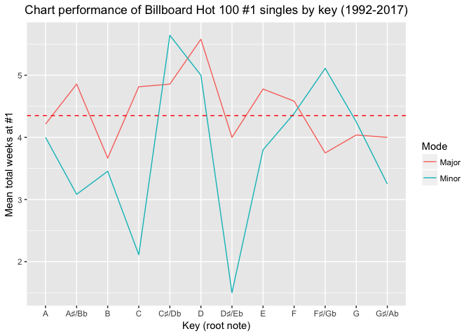<!-- -->

We can see that major keys tend to perform much more in line with the overall 
mean of 4.349 total weeks at number one (denoted by the dashed red line) than 
minor keys do. Also the number of major keys that outperform the overall mean is 
equal to those that underperform (six), while the split is 4:8 (respectively) 
for minor keys.

I decided to test the two best and two worst-performing keys to see whether 
their average performance deviated from the overall population (of post-1991 
number ones) in a statistically significant way. I accomplished this by using 
[one-tailed z-tests](https://en.wikipedia.org/wiki/Z-test) at the 95% 
significance level; the results are printed below:


```
##           Key Mean weeks  n      z     p
## 1     D Major       5.58 19  1.593 0.056
## 2 C♯/Db Minor       5.64 14  1.439 0.075
## 3 D♯/Eb Minor       1.50  2 -1.197 0.116
## 4     C Minor       2.11  9 -1.995 0.023
```

We can see that for the two best-performing keys, D Major and C♯/Db Minor, the 
[p-value](http://www.dummies.com/education/math/statistics/what-a-p-value-tells-you-about-statistical-data/) is greater than 0.05, so we must accept the null hypothesis: that 
the true mean total weeks spent at number one for these keys is the same as 
that of the overall population.

The same is true for D♯/Eb Minor, the worst performing key. However, for C 
Minor, the second worst-performing key in the modern era of Hot 100 number ones, 
the p-value *is* less than 0.05, and hence we must accept the alternative 
hypothesis: that the true mean total weeks spent at number one for number 
ones written in C Minor is lower than the population mean.

In summary, we have shown that the key that a number one song is written in is 
generally not a good predictor of how many weeks that song may remain at number 
one. However, songs written in C Minor may tend to underperform against the 
overall mean. 

It is important to place that result in context: total weeks at number one is an 
imperfect proxy for success, because it is not an independent outcome. There can 
only be a single number one at any given time. Therefore if two 'perfect' number 
one songs were released in the same time period, neither would likely live up to 
its full potential as far as this metric is concerned.

Also, the keys used in this investigation have been determined by Spotify, using 
software-based analysis. While I tested the data against [a sample of manually determined keys](http://flypaper.soundfly.com/features/defining-deconstructing-the-characteristics-of-a-billboard-1-hit-song/) and found it to be reasonably accurate, there is room for 
significant error. Hip hop songs in particular appear to be difficult for the 
software to analyse correctly, perhaps because of the lack of a prominent vocal 
melody.

While it certainly would have been a great story if it turned out all the most 
successful number ones were written in, say, D Major, that doesn't seem to be 
the case. Which is probably for the best, at least as far as the future 
diversity of pop music is concerned! 

### Chart performance by tempo

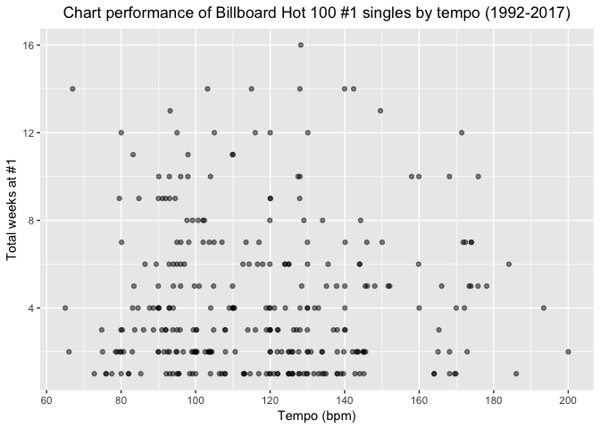<!-- -->

The chart above shows the relationship between total weeks at number one and 
tempo, which doesn't exhibit any strong correlation. In fact, calculating [Pearson's r](https://en.wikipedia.org/wiki/Pearson_correlation_coefficient) gives a value 
of 0.010 - pretty much zero!

### Correlation with weeks at number one

Based on these initial findings, I was curious: does performance (total weeks at 
number one) correlate strongly with *any* of our variables?


```
##            Var1         Var2 Correlation
## 14      weeks_1  total_weeks   0.9053539
## 16       energy     loudness   0.6869597
## 18      valence       energy   0.5125767
## 20       energy acousticness  -0.5108228
## 22      valence danceability   0.4693328
## 24 acousticness     loudness  -0.3337757
## 26      valence     loudness   0.3294917
## 28      valence acousticness  -0.3211362
## 30 danceability acousticness  -0.2836001
## 32      valence  duration_ms  -0.2687879
```

The table above shows every pair of (numeric) variables in the data set with a 
correlation of 0.25 or greater (positive or negative). We can see therefore that 
total weeks at number one is not strongly correlated with any of our musical 
variables, suggesting that there may not be any magic formula for writing a top 
performing number one hit. Which is as we'd expect; not only is music difficult 
to break down into such a simple set of building blocks, but successful number 
ones likely owe much of their longevity to the artist's marketing team for 
generating the necessary buzz.

I would be interested in expanding this research further by looking at a much 
larger set of songs together with their highest achieved chart position, and 
investigating whether any correlation exists between chart position and the 
variables charted above. [A similar investigation was carried out in 2011](http://evolver.fm/2011/01/10/what-makes-a-hit-song/) by two master's 
degree students at Rutgers University, [whose conclusions](https://sites.google.com/site/visualizingahit/conclusions) reflect 
many of my own findings:

> "...there are a few general 'tips' you can follow to better your chances of 
having a top ten hit song on the Billboard Hot 100. First, keep your tempo at a 
medium pace, around 120 beats per minute.  Write in a major key.  Make your song 
danceable and around 4.5 minutes in length, and 'turn it up to 11'."

### More correlations

One thing that does leap out from the correlation analysis above is the number 
of semi-strong relationships between Spotify's own musical variables. I decided 
to expand this analysis to the original data set (i.e. 1958-2017) to see if it 
held true:


```
##            Var1         Var2 Correlation
## 10       energy     loudness   0.6946068
## 12       energy acousticness  -0.5644538
## 14      valence       energy   0.4733018
## 16      valence danceability   0.4627233
## 18 acousticness     loudness  -0.4025845
## 20 danceability acousticness  -0.3901702
## 22       energy danceability   0.3406847
## 24 acousticness  duration_ms  -0.3021656
## 26 danceability     loudness   0.2645731
```

For the most part, it seems to be consistent with the post-1991 data. We can see 
that high scores for 'acousticness' (a measure of whether a track is acoustic or 
not) tend to accompany lower energy scores. Perhaps not massively surprising. 
It also seems that higher scores for energy and danceability tend to go hand in 
hand with higher scores for valence, which I've charted below:

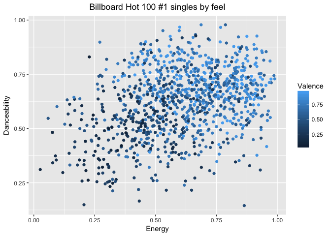<!-- -->

While there is certainly a high level of variance, the correlation between the 
three variables is pretty clear. In fact, danceability and energy explain up to 
43.8% of the variance in valence. 

Does this have any practical application? The short answer is "no" - Spotify 
calculates all of these measures itself without disclosing the precise 
methodology, so producing a track to be as energetic and 'danceable' as possible 
may not translate into a higher valence score. And even if it did, while our 
earlier analysis showed that number one singles tend to have higher valence 
scores than music in general, the valence itself likely plays a very small part 
in the overall chances of any given song making it to the top of the Billboard 
Hot 100. 

Thousands of bedroom producers around the world are writing songs every day 
that, given the right exposure, could have a realistic shot. [Take the story of Menace](http://www.bbc.co.uk/programmes/articles/J54JNph14dcQwCWj0J99jS/infectious-panda-desiigners-viral-hit-from-rochdale-to-the-white-house), the UK-based producer of the beat 
behind "Panda", Desiigner's 2016 breakout hit. Menace was working in a mobile 
phone shop when Desiigner came across his beat on YouTube. That chance 
discovery, amplified by Kanye West later discovering Desiigner's song and 
sampling it on "Father Stretch My Hands Pt. 2" gave Menace a number one single 
that knocked chart stalwarts Drake and Rihanna off the top spot. "Panda" managed 
a two week stint at number one, placing it in the top 66% of Hot 100 number 
ones.

Incidentally, that song has a valence score of only 0.256.


------

## Key findings

### Chart performance
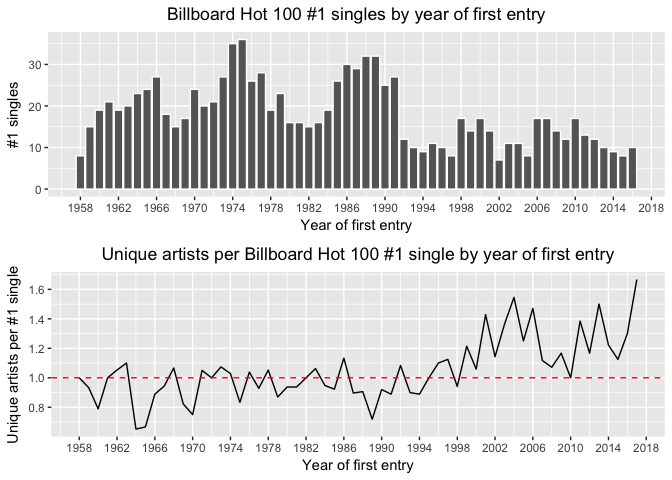<!-- -->

These charts together tell two sides of the same story: since 1992, we have been 
listening to a smaller number of unique number one songs than we had previously. 
However, we are also exposed to a far greater number of artists per number one 
song than ever before, largely because of the rise in the "featured artist" 
trend that sees two or more artists collaborate together on one track.

### Musical analysis
<!-- -->

I found this chart fascinating for a number of reasons:

* The trend is open to all sorts of interpretations, from those who might want 
to opine on the change in morals over time to those who seek confirmation that 
music "isn't what it used to be".
* As a fan of hip hop, a genre not known for its delicate language, this to me 
effectively chronicles the genre's rise in popular music.
* It effectively invalidates the work of the [Parents Music Resource Center](https://en.wikipedia.org/wiki/Parents_Music_Resource_Center), a group 
that sought to exercise a certain level of censorship over music, bringing about 
the introduction of the 'Parental Advisory' label on CDs in 1990. The subsequent 
rise in number one singles with explicit content shows that these warnings were 
either ineffectual, or perhaps even brought greater attention to genres like hip 
hop, aiding their rise.

### Musical features and chart performance
<!-- -->

This chart effectively answers the question that sparked this whole 
investigation: I wanted to know whether number one singles were all written in a 
small handful of keys and/or whether a particular key could predict greater 
commercial success.

Essentially the answer to both of these questions is "no": pop music remains 
diverse and there is no "magic key" that can predict success (although the key 
of C Minor may predict underperformance). 

The investigation also showed that certain keys (like C Major) are more 
favoured by number one songwriters than others, and major keys are more favoured 
than minor keys overall, which I found interesting, if not too surprising.

However, the popularity of C#/Db Major surprised me a lot. It can be an awkward 
key to play on certain instruments, so its status as the second most frequently 
used key in number one singles makes me question the accuracy of Spotify's key 
analysis software. This may unfortunately render some of my findings less 
conclusive than I had hoped.

------

## Reflection

This investigation was very much a labour of love, with a long data gathering 
and wrangling process paying off in a big way when I was finally able to dig in 
to the data and start exploring. The process involved:

* Manually compiling a Spotify playlist of every Hot 100 number one;
* Using Spotify's API to access musical data for every track;
* Scraping chart performance data from Wikipedia; and
* Marrying the two data sets together using fuzzy string matching.

While gathering the data was time-consuming and painstaking at times, I learnt a 
lot about pop music history and am satisfied with the finished product. The 
accuracy of certain variables is sadly less perfect than I'd hoped - the 5/4 
time signatures I documented in the body of the report give an idea of the 
limitations of musical analysis software. But in aggregate the data paint an 
interesting picture, with several relationships to explore.

As well as those presented in the key findings above, I was really interested to 
see the way average tempo has moved over time, seemingly reflecting wider 
musical trends. It was also interesting to see how many of my findings fit into 
wider narratives, whether about shortening song durations, the rise in profane 
lyrics or the big changes within the Hot 100 chart compilation process itself. 

As referenced throughout, I would be extremely interested in expanding much of 
this same analysis across a wider data set, incorporating non-number ones and 
trying to assess key differences between different singles of varying commercial 
success. The difference in average valence I stumbled across, between number 
ones and music more generally, looks potentially interesting, and I'd like to 
explore it further.

------

## Contact author

**Mark Bannister**  
E: [mspbannister\@gmail.com](mailto:mspbannister\@gmail.com)  
L: [mspbannister](https://www.linkedin.com/in/mspbannister/)  
T: [\@mspbannister](https://twitter.com/mspbannister)  
